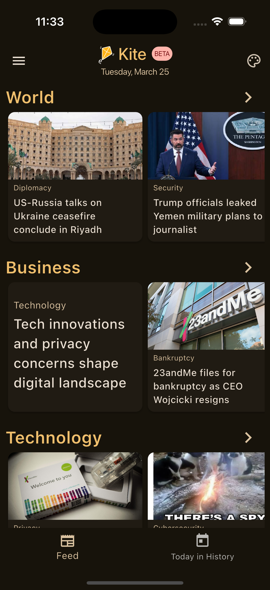
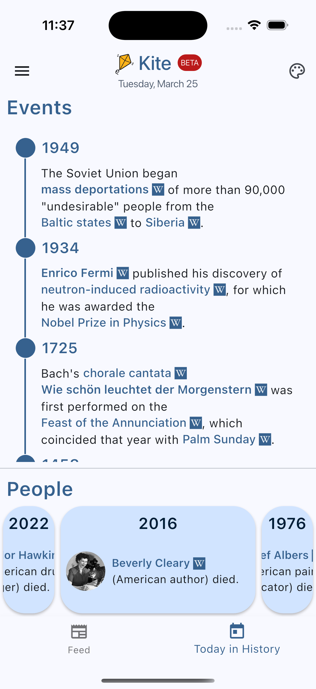

# A Flutter Port of [Kagi's Kite](https://kite.kagi.com/)
Kite is a category-based news aggregator that aims to streamline the consumption of news by offering various perspectives and contextual information (historical, business, etc.) for a story all in one place.

This app is a simple consumer of the Kite API. It intends to be fast and responsive much like the Kite website and other Kagi products.

# Screenshots





More are availble in the `screenshots` folder.

# Installation
## Android
Simply navigate to the [Releases](https://github.com/imak101/kite_flutter_port/releases) section to download and install `kite.apk`.

## iOS and iPadOS

A TestFlight link will be published momentarily.

# Run Locally / Develop
1. Clone the repository
```
git clone https://github.com/imak101/Kagi-Kite-Flutter-Port.git
```
2. Open the directory
```
cd Kagi-Kite-Flutter-Port
```
3. Get dependencies
```
flutter pub get
```
4. Run the code generator
```
dart run build_runner build --delete-conflicting-outputs
```
5. Run the app. Flutter will list current available devices to run the app on.
```
flutter run
```
